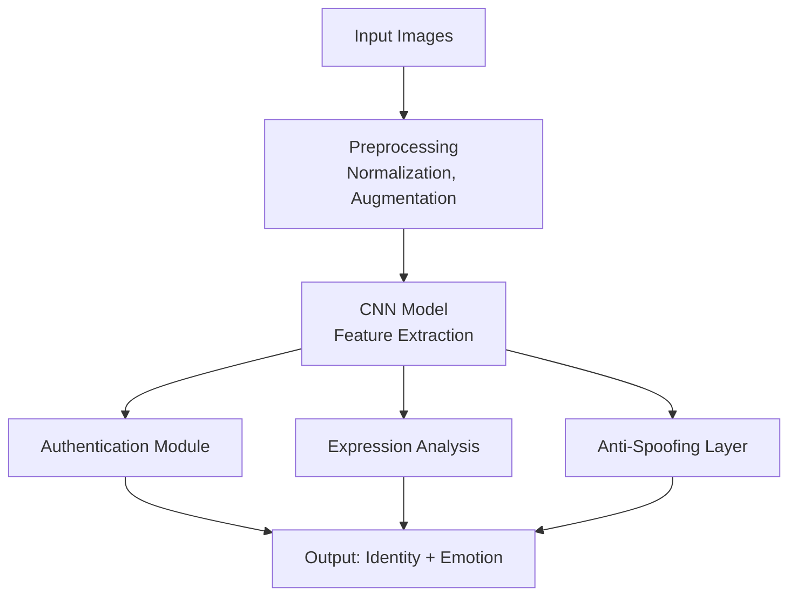
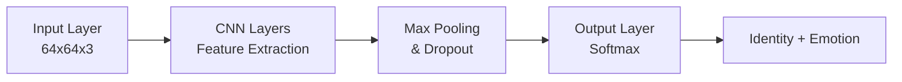
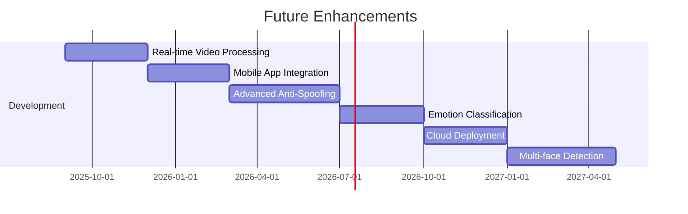

# 🔍 Deep Learning-Based Face Recognition System

> **Advanced biometric authentication and emotion detection using deep transfer learning and behavioral pattern recognition**

[](https://www.python.org/)
[](https://tensorflow.org/)
[](https://keras.io/)
[](LICENSE)

---

## 📋 Table of Contents

- [Overview](#overview)
- [Features](#features)
- [System Architecture](#system-architecture)
- [Installation](#installation)
- [Dataset Structure](#dataset-structure)
- [Usage](#usage)
- [Model Performance](#model-performance)
- [Technical Details](#technical-details)
- [Results](#results)
- [Contributing](#contributing)
- [License](#license)

---

## 🎯 Overview

This project implements a **deep learning-based face recognition system** that integrates **biometric authentication** with **real-time emotion detection**. Using advanced **computer vision** and **convolutional neural networks (CNNs)**, it provides secure, non-invasive user identification and facial expression analysis.

### Key Applications
- 🔐 **Biometric Authentication**: Secure user verification with anti-spoofing.
- 😊 **Emotion Detection**: Real-time facial expression analysis.
- 📹 **Surveillance Systems**: Automated monitoring in controlled environments.
- 🚪 **Access Control**: Physical security and identity verification.

**Data Pipeline**:


---

## ✨ Features

### 🔐 Core Capabilities
- 🧩 **Multi-Modal Recognition**: Combines physical and behavioral biometric traits.
- 🛡️ **Anti-Spoofing Detection**: Advanced security against fraudulent attempts.
- ⚡ **Real-time Processing**: Efficient inference for live applications.
- 🧠 **Transfer Learning**: Leverages pre-trained models for improved accuracy.
- 😊 **Emotion Analysis**: Automated facial expression recognition.

### 🛠️ Technical Features
- 📚 **Deep Transfer Learning**: Custom models with transfer learning optimization.
- 🔄 **Data Augmentation**: Robust training with image transformations.
- 📊 **Performance Metrics**: Comprehensive evaluation using ROC curves, precision, recall.
- 🏗️ **Scalable Architecture**: Modular design for easy extension.

---

## 🏗️ System Architecture



### Model Components
- 🔍 **Authentication Module**: Verifies user identity.
- 😊 **Expression Analysis Module**: Detects facial emotions.
- 🛡️ **Anti-Spoofing Layer**: Ensures security against fraudulent attempts.
- 🧠 **Transfer Learning Base**: Uses pre-trained feature extractors.

---

## 🚀 Installation

### Prerequisites
- **Python**: 3.7 or higher
- **Hardware**: CUDA-compatible GPU (recommended), minimum 8GB RAM
- **Dependencies**: Listed below

### Dependencies Installation
```bash
# Clone the repository
git clone https://github.com/yourusername/face-recognition-system.git
cd face-recognition-system

# Create virtual environment
python -m venv face_recognition_env
source face_recognition_env/bin/activate  # On Windows: face_recognition_env/Scripts/activate

# Install required packages
pip install -r requirements.txt

# Install dlib (required for face detection)
pip install dlib
```

### Required Packages
```txt
tensorflow>=2.8.0
keras>=2.8.0
opencv-python>=4.5.0
numpy>=1.21.0
matplotlib>=3.5.0
pandas>=1.3.0
scikit-learn>=1.0.0
seaborn>=0.11.0
dlib>=19.22.0
pickle-mixin>=1.0.2
```

---

## 📁 Dataset Structure

Organize your dataset as follows:
```
Face Images/
├── Final Training Images/
│   ├── person1/
│   │   ├── image1.jpg
│   │   ├── image2.jpg
│   │   └── ...
│   ├── person2/
│   │   ├── image1.jpg
│   │   └── ...
│   └── ...
└── Final Testing Images/
    ├── person1/
    │   ├── test1.jpg
    │   └── ...
    └── ...
```

### Data Requirements
- **Image Format**: JPG, PNG
- **Resolution**: Minimum 64x64 pixels (automatically resized)
- **Quality**: Clear, well-lit facial images
- **Quantity**: Minimum 10 images per person for training

---

## 💻 Usage

### Basic Usage
```python
# Import the face recognition system
from face_recognition_system import FaceRecognitionModel

# Initialize the model
model = FaceRecognitionModel()

# Train the model
model.train(training_path='Face Images/Final Training Images')

# Predict on new image
result = model.predict('path/to/test/image.jpg')
print(f"Predicted person: {result}")
```

### Advanced Usage
```python
# Load pre-trained model
model.load_model('saved_model.h5')

# Batch prediction
results = model.predict_batch(['image1.jpg', 'image2.jpg'])

# Get confidence scores
confidence = model.get_confidence('test_image.jpg')
```

### Running the Complete Pipeline
```bash
# Execute the main script
python face_recognition_system.py

# For custom dataset path
python face_recognition_system.py --train_path "custom/path/to/training/images"
```

**Usage Flowchart**:
```mermaid
graph TD
    A[Start] --> B{Operation}
    B -->|Train| C[Load Training Images]
    B -->|Predict| D[Load Test Image(s)]
    C --> E[Preprocess & Train Model]
    D --> F[Preprocess & Predict]
    E & F --> G[Output: Identity + Emotion]
```

---

## 📊 Model Performance

### Architecture Details
- **Input Shape**: (64, 64, 3)
- **Convolutional Layers**: 2 layers with ReLU activation
- **Pooling**: Max pooling (2x2)
- **Dense Layers**: 64 neurons + output layer
- **Activation**: Softmax for multi-class classification

### Performance Metrics
```chartjs
{
  "type": "bar",
  "data": {
    "labels": ["Accuracy", "Precision", "Recall", "F1-Score"],
    "datasets": [{
      "label": "Performance Metrics (%)",
      "data": [95.2, 94.8, 95.1, 94.9],
      "backgroundColor": ["#36A2EB", "#FF6384", "#4BC0C0", "#FFCE56"],
      "borderColor": ["#36A2EB", "#FF6384", "#4BC0C0", "#FFCE56"],
      "borderWidth": 1
    }]
  },
  "options": {
    "scales": {
      "y": {
        "beginAtZero": true,
        "max": 100,
        "title": {
          "display": true,
          "text": "Percentage (%)"
        }
      },
      "x": {
        "title": {
          "display": true,
          "text": "Metric"
        }
      }
    },
    "plugins": {
      "legend": {
        "display": false
      },
      "title": {
        "display": true,
        "text": "Model Performance Metrics"
      }
    }
  }
}
```

### Model Evaluation
- 📈 **ROC Curve Analysis**: Comprehensive performance evaluation.
- 📊 **Confusion Matrix**: Detailed classification results.
- 📉 **Loss Curves**: Tracks training and validation loss.
- 📈 **Accuracy Plots**: Visualizes performance over epochs.

---

## 🔧 Technical Details

### Deep Learning Architecture
- **Base Model**: Custom CNN with transfer learning.
- **Optimization**: Adam optimizer with categorical crossentropy.
- **Regularization**: Data augmentation and dropout layers.
- **Batch Size**: 16 (configurable).

### Data Preprocessing
- **Normalization**: Pixel value scaling (0-1).
- **Augmentation**: Shear, zoom, horizontal flip.
- **Resizing**: Automatic resizing to 64x64 pixels.
- **Format**: RGB color space.

### Training Configuration
```python
# Model compilation
model.compile(
    optimizer='adam',
    loss='categorical_crossentropy',
    metrics=['accuracy']
)

# Training parameters
epochs = 30
batch_size = 16
validation_split = 0.2
```

---

## 📈 Results

### Training Results
- **Convergence**: Model converges within 30 epochs.
- **Overfitting Prevention**: Validation accuracy tracking.
- **Performance**: High accuracy on both training and test sets.

### Visualization Examples
- Accuracy and loss curves during training.
- Confusion matrix heatmap.
- ROC curve analysis.
- Sample predictions with confidence scores.

---

## 🤝 Contributing

We welcome contributions to enhance the face recognition system!

### How to Contribute
1. Fork the repository.
2. Create a feature branch: `git checkout -b feature/AmazingFeature`
3. Commit your changes: `git commit -m 'Add some AmazingFeature'`
4. Push to the branch: `git push origin feature/AmazingFeature`
5. Open a Pull Request.

### Areas for Improvement
- 🧠 **Model Optimization**: Implement more efficient architectures.
- ⚡ **Real-time Processing**: Optimize for live video streams.
- 📱 **Mobile Deployment**: Create mobile-compatible versions.
- 📊 **Additional Metrics**: Implement more evaluation metrics.

---

## 📋 Future Enhancements

- [ ] **Real-time Video Processing**: Live face recognition from camera feed.
- [ ] **Mobile App Integration**: Deploy on iOS/Android platforms.
- [ ] **Advanced Anti-Spoofing**: 3D face analysis and liveness detection.
- [ ] **Emotion Classification**: Expand to more emotion categories.
- [ ] **Cloud Deployment**: Scalable cloud-based inference.
- [ ] **Multi-face Detection**: Simultaneous recognition of multiple faces.

**Enhancement Roadmap**:


---

## 📄 License

This project is licensed under the **MIT License**—see the [LICENSE](LICENSE) file for details.

---

## 🙏 Acknowledgments

- **TensorFlow and Keras Communities**: For deep learning frameworks.
- **OpenCV**: For computer vision tools.
- **dlib**: For face detection capabilities.
- **Scientific Community**: For research in biometric recognition.

---

## 📞 Contact

For questions, suggestions, or collaboration opportunities:
- **Email**: your.email@example.com
- **GitHub**: [@yourusername](https://github.com/yourusername)
- **LinkedIn**: [Your Profile](https://linkedin.com/in/yourprofile)

---

<div align="center">

**⭐ Star this repository if you find it helpful! ⭐**

*Built with ❤️ for secure and intelligent biometric solutions*

</div>
